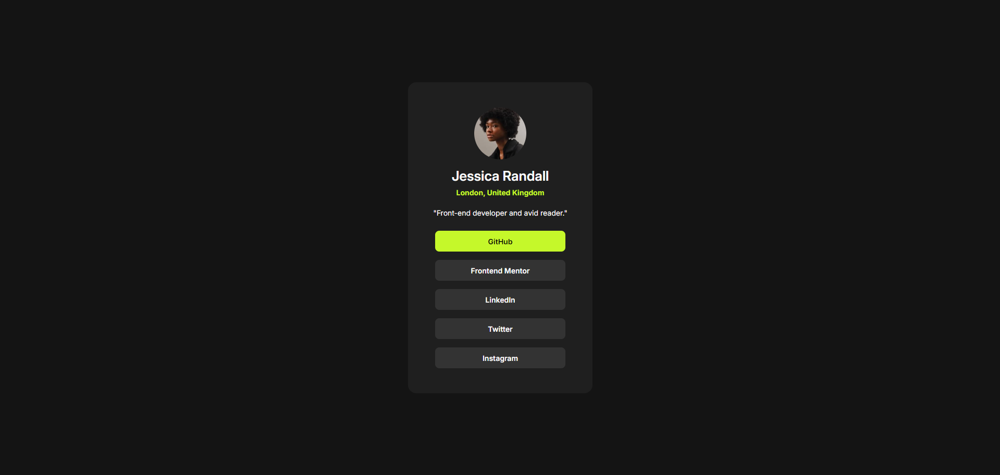

# Frontend Mentor - Social links profile solution

This is a solution to the [Social links profile challenge on Frontend Mentor](https://www.frontendmentor.io/challenges/social-links-profile-UG32l9m6dQ).

## Table of contents

- [Overview](#overview)
  - [Screenshot](#screenshot)
  - [Links](#links)
- [My process](#my-process)
  - [Built with](#built-with)
  - [What I learned](#what-i-learned)
  - [Useful resources](#useful-resources)
- [Author](#author)

## Overview

### Screenshot



### Links

- Live Site URL: <a href="https://frontend-mentor-social-link-profile-aec32.web.app/" target="_blank">Click Here</a>

## My process

### Built with

- HTML5
- CSS
- CSS Flex
- CSS Grid
- Hosting - Firebase

### What I learned

I learned how to use flex and grid in this project. I learned how to use flex to align the items in the container and how to use grid to create a layout.

```css
.links {
	padding-top: 1.5rem;
	display: grid;
	gap: 1rem;
}

.links > p {
	background-color: var(--clr-link);
	font-weight: var(--fw-regular);
	display: flex;
	align-items: center;
	justify-content: center;

	width: 250px;
	height: 40px;
	border-radius: 0.5rem;
}
```

### Useful resources

- <a href="https://css-tricks.com/snippets/css/a-guide-to-flexbox/" target="_blank">Flexbox</a> - This helped me understand and how to use flex.
- <a href="https://developer.mozilla.org/en-US/docs/Web/HTML" target="_blank">Learning HTML</a> - This website helped me understand different tags and elemetns in HTML.
- <a href="https://developer.mozilla.org/en-US/docs/Web/CSS" target="_blank">Learning CSS</a> - This website helped me understand different properties and values in CSS.
- <a href="https://css-tricks.com/snippets/css/complete-guide-grid/" target="_blank">Grid</a> - This helped me understand and how to use grid.

## Author

- Linkedin - [Jaweed Inayathulla](https://www.linkedin.com/in/jaweedinayathulla/)
- Frontend Mentor - [@InaJaweed](https://www.frontendmentor.io/profile/InaJaweed)
